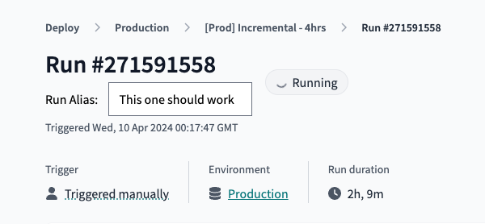
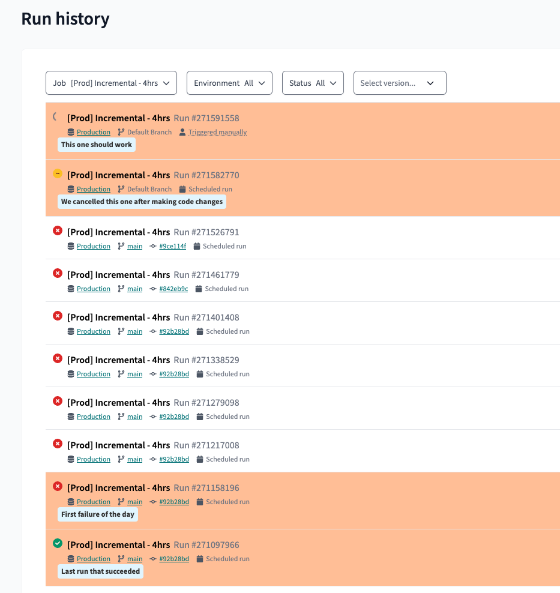

# dbt-cloud-chrome-extension

A hacky Chrome extension that adds aliases and background colours to certain dbt Cloud runs, for ease of visual identification

## Installation

Enable developer mode at chrome://extensions and load an unpacked extension, as described [here](https://developer.chrome.com/docs/extensions/get-started/tutorial/hello-world#load-unpacked)

## Usage

### Setting an alias

Click into a run's details page and fill out the alias box. Delete the text to clear.

### Viewing an alias

Any page that shows a list of runs will display the alias and highlight the background row.

